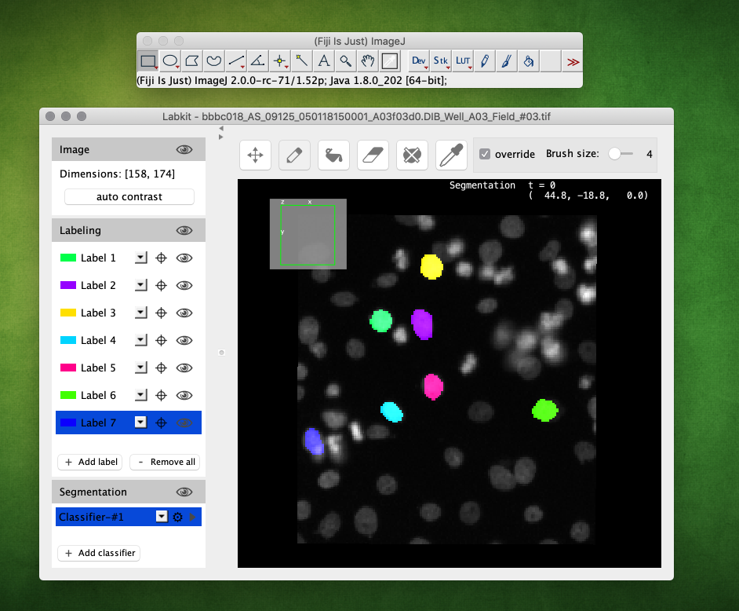

[](https://pypi.org/project/stardist)
[](https://travis-ci.com/mpicbg-csbd/stardist)
[](https://ci.appveyor.com/project/UweSchmidt/stardist/branch/master)

# *StarDist* - Object Detection with Star-convex Shapes 


This repository contains the implementation of star-convex object detection for 2D and 3D images, as described in the papers: 


- Uwe Schmidt, Martin Weigert, Coleman Broaddus, and Gene Myers.  
[*Cell Detection with Star-convex Polygons*](https://arxiv.org/abs/1806.03535).  
International Conference on Medical Image Computing and Computer-Assisted Intervention (MICCAI), Granada, Spain, September 2018.

- Martin Weigert, Uwe Schmidt, Robert Haase, Ko Sugawara, and Gene Myers.  
[*Star-convex Polyhedra for 3D Object Detection and Segmentation in Microscopy*](https://arxiv.org/abs/1908.03636).  
arXiv, 2019

Please [cite the paper(s)](#how-to-cite) if you are using this code in your research.


## Overview

The following figure illustrates the general approach for 2D images. The training data consists of corresponding pairs of input (i.e. raw) images and fully annotated label images (i.e. every pixel is labeled with a unique object id or 0 for background). 
A model is trained to densely predict the distances (r) to the object boundary along a fixed set of rays and object probabilities (d), which together produce an overcomplete set of candidate polygons for a given input image. The final result is obtained via non-maximum supression (NMS) of these candidates.  


The approach for 3D volumes is similar to the one described for 2D, using pairs of input and fully annotated label volumes as training data.


## Installation

This package requires Python 3.5 (or newer).

Please first [install TensorFlow 1.x](https://www.tensorflow.org/install)
by following the official instructions. (**Do not choose TensorFlow 2.x**)
For [GPU support](https://www.tensorflow.org/install/gpu), it is very
important to install the specific versions of CUDA and cuDNN that are
compatible with the respective version of TensorFlow.

*StarDist* can then be installed with `pip`:

    pip install stardist

#### Notes

- Depending on your Python installation, you may need to use `pip3` instead of `pip`.
- Since this package relies on a C++ extension, you could run into compilation problems (see [Troubleshooting](#troubleshooting) below). We currently do not provide pre-compiled binaries.
- StarDist uses the deep learning library [Keras](https://keras.io), which requires a suitable [backend](https://keras.io/backend/#keras-backends) (we currently only support [TensorFlow](http://www.tensorflow.org/)).
- *(Optional)* You need to install [gputools](https://github.com/maweigert/gputools) if you want to use OpenCL-based computations on the GPU to speed up training.
- *(Optional)* You might experience improved performance during training if you additionally install the [Multi-Label Anisotropic 3D Euclidean Distance Transform (MLAEDT-3D)](https://github.com/seung-lab/euclidean-distance-transform-3d).


## Usage

We provide example workflows for 2D and 3D via Jupyter [notebooks](https://github.com/mpicbg-csbd/stardist/tree/master/examples) that illustrate how this package can be used.


### Annotating Images

To train a *StarDist* model you will need some ground-truth annotations: for every raw training image there has to be a corresponding label image where all pixels of a cell region are labeled with a distinct integer (and background pixels are labeled with 0). To create such label masks, one can use e.g. the Imagej/Fiji plugin [Labkit](https://imagej.net/Labkit):

1. Install [Fiji](https://fiji.sc) and the [Labkit](https://imagej.net/Labkit) plugin
2. Open the (2D or 3D) image and start Labkit via `Plugins > Segmentation > Labkit`
3. Sucessively add a new label and annotate a single cell instance with the brush tool (always check the `override` option) until *all* cells are labeled
4. Export the label image via `Save Labeling...` and `File format > TIF Image` 




Additional tips:

* The Labkit viewer uses [BigDataViewer](https://imagej.net/BigDataViewer) and its keybindings (e.g. <kbd>s</kbd> for contrast options, <kbd>CTRL</kbd>+<kbd>Shift</kbd>+<kbd>mouse-wheel</kbd> for zoom-in/out etc.)
* For 3D images (XYZ) it is best to first convert it to a (XYT) timeseries (via `Re-Order Hyperstack` and swapping `z` and `t`) and then use <kbd>[</kbd> and <kbd>]</kbd> in Labkit to walk through the slices.    

## Troubleshooting

Installation requires Python 3.5 (or newer) and a working C++ compiler. We have only tested [GCC](http://gcc.gnu.org) (macOS, Linux), [Clang](https://clang.llvm.org) (macOS), and [Visual Studio](https://visualstudio.microsoft.com) (Windows 10). Please [open an issue](https://github.com/mpicbg-csbd/stardist/issues) if you have problems that are not resolved by the information below.

If available, the C++ code will make use of [OpenMP](https://en.wikipedia.org/wiki/OpenMP) to exploit multiple CPU cores for substantially reduced runtime on modern CPUs. This can be important to prevent slow model training.


### macOS
The default Apple C/C++ compiler (`clang`) does not come with OpenMP support and the package build will likely fail.
To properly build `stardist` you need to install a OpenMP-enabled GCC compiler, e.g. via [Homebrew](https://brew.sh) with `brew install gcc` (which will currently install `gcc-9`/`g++-9`). After that, you can build the package like this (adjust compiler names/paths as necessary):

    CC=gcc-9 CXX=g++-9 pip install stardist


### Windows
Please install the [Build Tools for Visual Studio 2019](https://www.visualstudio.com/downloads/#build-tools-for-visual-studio-2019) from Microsoft to compile extensions for Python 3.5 and newer (see [this](https://wiki.python.org/moin/WindowsCompilers) for further information). During installation, make sure to select the *C++ build tools*. Note that the compiler comes with OpenMP support.

## ImageJ/Fiji Plugin

We currently provide a ImageJ/Fiji plugin that can be used to run pretrained StarDist models on 2D or 2D+time images. Installation and usage instructions can be found at the [plugin page](https://imagej.net/StarDist).


## How to cite 
``` 
@inproceedings{schmidt2018,
  author    = {Uwe Schmidt and Martin Weigert and Coleman Broaddus and Gene Myers},
  title     = {Cell Detection with Star-Convex Polygons},
  booktitle = {Medical Image Computing and Computer Assisted Intervention - {MICCAI} 
  2018 - 21st International Conference, Granada, Spain, September 16-20, 2018, Proceedings, Part {II}},
  pages     = {265--273},
  year      = {2018},
  doi       = {10.1007/978-3-030-00934-2_30}
}

@article{weigert2019,
  author    = {Martin Weigert and Uwe Schmidt and Robert Haase and Ko Sugawara and Gene Myers},
  title     = {Star-convex Polyhedra for 3D Object Detection and Segmentation in Microscopy},
  journal   = {arXiv:1908.03636},
  year      = {2019}
}
```
